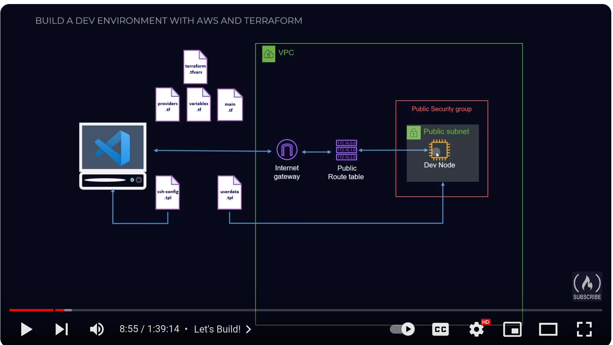

[Learn Terraform (and AWS) by Building a Dev Environment – Full Course for Beginners](https://www.youtube.com/watch?v=iRaai1IBlB0)

[Terraform 101 - Create multiple AWS IAM users using loop function](https://www.youtube.com/watch?v=-OsqKBTNedc)



Useful previously unknown commands
```bash
terraform state list
terraform show
terraform state show [something from the list ]
terraform state push
terraform state rm
```

OMG why do other tuts not use these tools:
```bash
echo $(terraform state show module.vpc.aws_vpc.mtc_vpc) >> ../notes.md 
```

# module.vpc.aws_vpc.mtc_vpc: resource "aws_vpc" "mtc_vpc" { arn = "arn:aws:ec2:us-east-1:296253502302:vpc/vpc-0517a5e6ed895d9f1" assign_generated_ipv6_cidr_block = false cidr_block = "10.0.0.0/16" default_network_acl_id = "acl-096b6445d7492993c" default_route_table_id = "rtb-0b34922af3dccd143" default_security_group_id = "sg-0bff171f5b1f4a10f" dhcp_options_id = "dopt-0e9f26e3ae34a215f" enable_dns_hostnames = true enable_dns_support = true enable_network_address_usage_metrics = false id = "vpc-0517a5e6ed895d9f1" instance_tenancy = "default" ipv6_netmask_length = 0 main_route_table_id = "rtb-0b34922af3dccd143" owner_id = "296253502302" tags = { "Name" = "dev" } tags_all = { "Name" = "dev" } }
